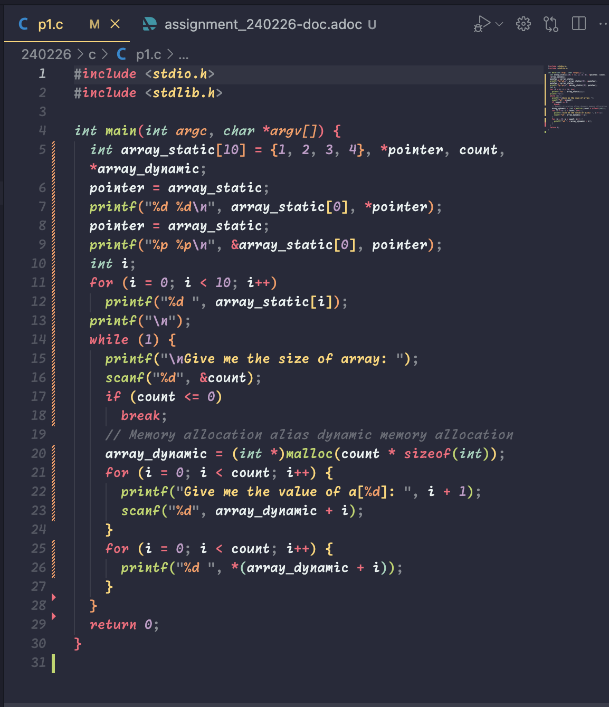
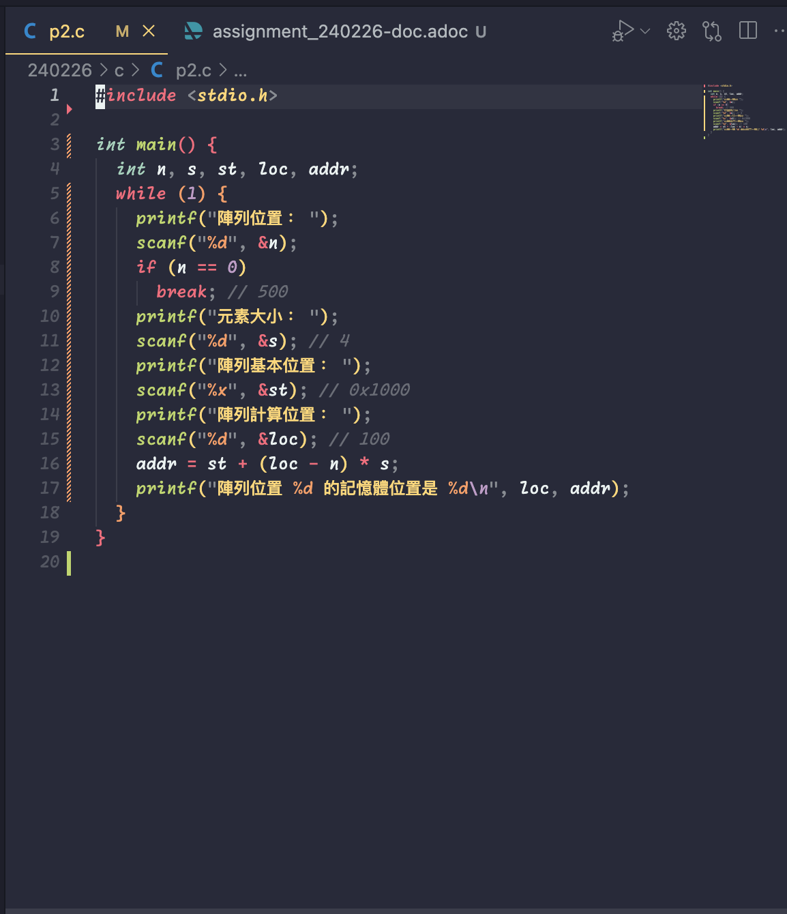
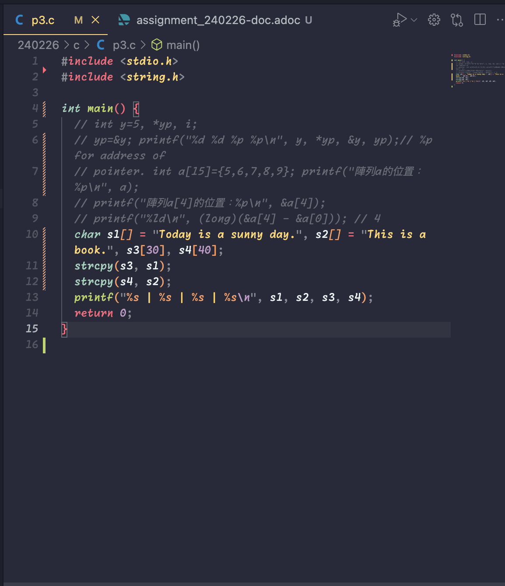
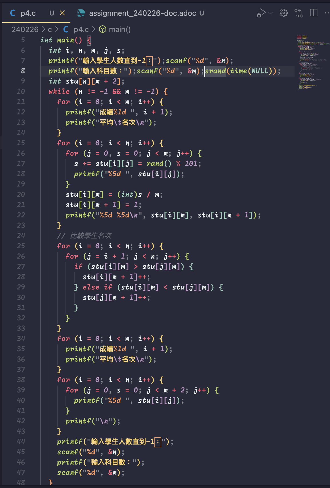
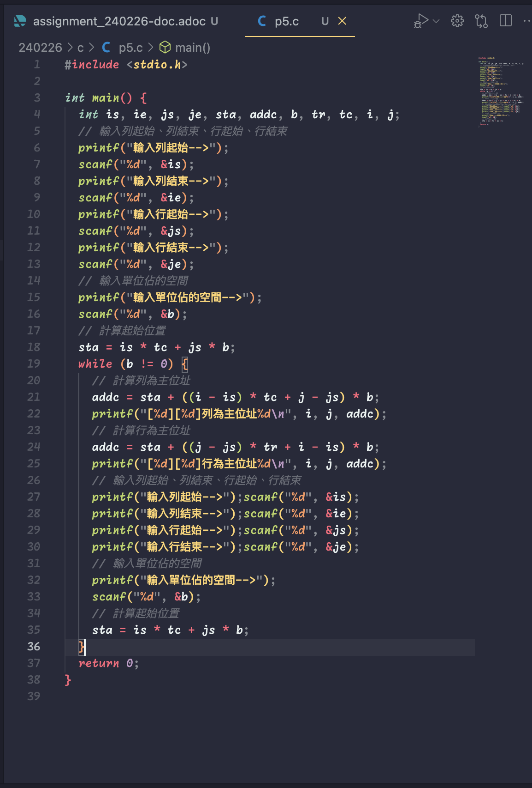

= Assignment of Data Structures =
:stem: latexmath
211410146—— 資工系 王光鈺

== Class Exercises ==

=== P1: 靜態陣列、動態陣列的操作。 ===

NOTE: C語言中動態陣列的操作會使用指標的使用。

=== P2: 計算陣列中特定元素的記憶體位址。 ===

=== P3: C語言中的字串操作。 ===

=== P4: 二維陣列的操作。 === 

=== P5: 二維陣列在記憶體中的位址計算。 ===

== Assignments ==

NOTE: latexmath:[A(m:q, n:r)] 代表的是陣列的範圍，m、n代表的是陣列的起始位置，q、r代表的是陣列的結束位置。

.以列為主的計算方式
[latexmath]
++++
Loc(a_{ij}) = a+((i-1_1)-1)*n*d+((j-1_2+1)-1)*d \\
= a+(i-1_1)*n*d+(j-1_2)*d
++++

.以行為主的計算方式
[latexmath]
++++
Loc(a_{ij}) = 
a+((i-1_1+1)-1)*d+((j-1_2+1)-1)*m*d \\
= a+(i-1_1)*d+(j-1_2)*m*d
++++

=== Ex3 ===

*Question*: A(-3:5, -4:2) 陣列的起始位置 A(-3,-4)=100，以列為主。請問Loc(A(1,1))=?

*Answer*: 137

*Explanation*: 
latexmath:[1-(-3) = 4]，latexmath:[1-(-4) = 5]。
-3到5的距離為latexmath:[5-(-3)=8]，所以latexmath:[d=8]。
所以A(1,-4)=latexmath:[100+4*8+0*8=132]，A(1,1)=latexmath:[132+5=137]。

=== Ex4 ===

*Question*: 若 A(3,3)在位置121，A(6,4)在位置159，則A(4,5)在位置?(單位空間d=1)

*Answer*: 133

*Explanation*: 
latexmath:[A(3,3) = 121]，latexmath:[A(6,3) = 158]。
因此從A(3,3)到A(6,3)的距離為latexmath:[158-121=37]，所以latexmath:[d=37/3=12]，每行陣列元素儲存空間為12。
從A(3,3)到A(4,3)的距離為latexmath:[12]，所以A(4,3)在位置latexmath:[121+12=133]。

=== Ex5 ===

*Question*: 若 A(1,1)在位置2，A(2,3)在位置18，試求A(4,5)的位置?

*Answer*: 51

*Explanation*: 
latexmath:[A(1,1) = 2]，latexmath:[A(2,2) = 17]。
從A(1,1)到A(2,2)的距離為latexmath:[17-2=15]，所以陣列元素儲存空間為15。
所以A(4,1)=latexmath:[2+15*3=47]，A(4,5)=latexmath:[47+4=51]。

=== Ex6 ===

*Question*: 請說明稀疏矩陣的定義，並舉例說明之。

*Answer*: 一個矩陣中大部分的數值為0。
Ex: 一個latexmath:[5\times5]的稀疏矩陣如下：
[latexmath]
++++
\begin{bmatrix}
1 & 0 & 0 & 0 & 0 \\
0 & 0 & 0 & 0 & 0 \\
0 & 0 & 0 & 4 & 0 \\
0 & 7 & 0 & 0 & 0 \\
0 & 0 & 0 & 0 & 6 \\
\end{bmatrix}
++++

=== Ex7 ===

*Question*: 假設陣列A[-1:3, 2:4, 1:4, -2:1]是以列為主，起始位置 latexmath:[\alpha = 200]，每個陣列元素儲存空間為5。請問A[-1, 2, 1, -2]、 A[3, 4, 4, 1]、 A[3, 2, 1, 0] 的位置？

*Answer*: A[-1, 2, 1, -2] = 200, A[3, 4, 4, 1] = 491, A[3, 2, 1, 0] = 450
